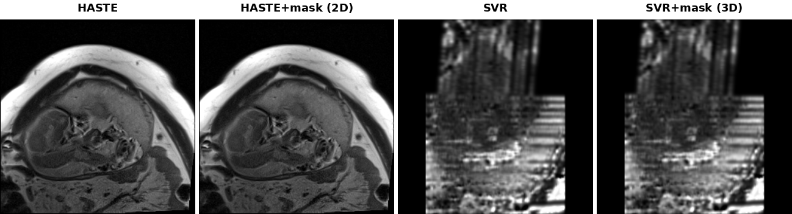
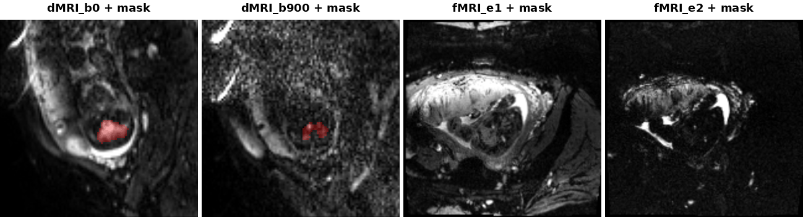

# Fetal-BET2: Brain Extraction Tool for Fetal MRI

Fetal brain extraction is performed using **Fetal-BET2**, a multimodal fetal brain
extraction model developed by our group and publicly available on
[GitHub](https://github.com/IntelligentImaging/fetal-bet2) and
[Docker Hub](https://github.com/IntelligentImaging/fetal-bet2/pkgs/container/fetal-bet2)
(`ghcr.io/intelligentimaging/fetal-bet2:latest`).

Fetal-BET2 is a fully supervised deep learning method based on a U-Net architecture,
trained with extensive data augmentation to improve robustness to variations in fetal
orientation, image contrast, noise, and acquisition characteristics. The model was
trained on approximately 1,600 3D volumes and 55,000 2D slices across T2w, dMRI, and
fMRI.

Fetal-BET2 supports 2D, 3D, and 4D inference:
- **2D inference** is used for **T2w stacks**, to better accommodate interslice fetal
  motion before reconstruction.
- **3D inference** is used for **SVR-reconstructed T2w volumes**, because motion has
  already been corrected during reconstruction.
- **4D inference** is used for **dMRI and fMRI time series**: each timepoint/direction
  is run through the same 3D sliding-window pipeline independently, taking advantage of
  their rapid EPI readout and correspondingly reduced interslice motion within a volume,
  then the predicted masks are stacked back into a single 4D output.





## Table of Contents
- [Installation](#installation)
  - [Requirements](#requirements)
  - [Docker](#docker)
- [Usage](#usage)
  - [Training](#training)
  - [Inference](#inference)
- [Fine-tuning on New Data](#fine-tuning-on-new-data)
- [Disclaimer](#disclaimer)
- [Citation and acknowledgements](#citation-and-acknowledgements)
- [Contact](#contact)
- [Acknowledgement](#acknowledgement)
- [License](#license)

## Installation

### Requirements

- Python 3.9
- torch==1.13.1+cu117
- monai==1.2.0
- Docker 20.10+ (optional but recommended for inference)

See `src/requirements.txt` for the full list.

```bash
# Clone the repository
git clone https://github.com/IntelligentImaging/fetal-bet2.git
cd fetal-bet2

# Install Python dependencies
pip install -r src/requirements.txt
```

### Docker

```bash
# Pull the pre-built image
docker pull ghcr.io/intelligentimaging/fetal-bet2:latest

# ...or build it yourself from source
docker build -t fetal-bet2 -f Docker/Dockerfile Docker/
```

## Usage

### Training

```bash
cd src
# --cfg selects the model dimensionality: code/config_imagine.yml (3D) or code/config_imagine_2D.yml (2D)
python code/train.py --cfg code/config_imagine.yml
python code/train.py --cfg code/config_imagine_2D.yml
```

### Inference

The simplest way to run inference is the unified entry point: it inspects each input
file's header and automatically picks the right pipeline (2D for a thick-slice stack
like a T2w stack, 3D for a near-isotropic volume like an SVR reconstruction, 4D for a
time/direction series like dMRI/fMRI), so you don't need to know the data type in advance.

```bash
cd src

# single file or a directory (mixed data types in one directory are fine)
python inference.py --input_path /path/to/input.nii.gz --save_path /path/to/output_dir/
python inference.py --input_path /path/to/input_dir/   --save_path /path/to/output_dir/

# force a specific pipeline for 3D data (auto-detection can be overridden either way)
python inference.py --input_path /path/to/input.nii.gz --save_path /path/to/output_dir/ --pipeline 3d
```

`inference.py` arguments:

| Argument | Default | Description |
|---|---|---|
| `--input_path` | *(required)* | A single `.nii.gz` file, or a directory of them (each file is routed to its own pipeline; files landing on the same pipeline are batched into one call). |
| `--save_path` | *(required)* | Directory to save the predicted mask(s) to. |
| `--pipeline` | `auto` | `auto` picks 2D/3D/4D from the input's header. Can be forced to `2d` or `3d` for 3D data (a modeling choice, not a correctness one); 4D data can only use `4d`. |
| `--device` | unset | Which device to run on, e.g. `cuda`, `cuda:0`, `cpu`. Leave unset to auto-pick `cuda` if available, else `cpu`. |
| `--n_gpu` | unset | Number of GPUs to use; `1` (the default) runs on a single device, `>1` wraps the model in `torch.nn.DataParallel` to split each batch across that many GPUs. |
| `--refine` | unset | Whether to run `mask_refine.py`'s connected-component cleanup on the predicted mask, removing small spatially disconnected mis-segmentation. `1` = on (the default), `0` = save the raw predicted mask instead. |
| `--amp` | unset | Whether to use mixed-precision (fp16 autocast) inference on CUDA. `1` = on, `0` = off. Only applies to the 2D/3D pipelines (4D has no `--amp`). |

Running via Docker (see [Docker](#docker) above to pull or build the image; substitute
`fetal-bet2` below for the image name/tag you used if you built it yourself):

```bash
docker run --rm --gpus all \
    -v {HOST_DATA_DIR}:/data \
    ghcr.io/intelligentimaging/fetal-bet2:latest \
    --input_path /data/{INPUT_PATH} \
    --save_path /data/{OUTPUT_DIR}
```

- `{HOST_DATA_DIR}` — host directory mounted into the container as `/data`; it should
  contain `{INPUT_PATH}`, and `{OUTPUT_DIR}` will be written inside it.
- `{INPUT_PATH}` — a single `.nii.gz` file or a directory of them; the pipeline (2D/3D/4D)
  is auto-detected from each file's header, or can be forced with `--pipeline {2d,3d,4d}`.
- The container runs as root, so output mask(s) would normally end up root-owned on the
  host; `inference.py` chmods just the file(s) it produces to be read/write/delete-able by
  anyone, so you don't need `sudo` or a `--user` flag to work with them afterwards.

## Fine-tuning on New Data

Training data (not included in this repository — MRI data is not distributed here)
should be organized under a `dataset/` directory as follows; this is the layout the
released weights were trained on (~1,600 3D volumes / ~55,000 2D slices):

```
dataset/
├── volume_all/           # 3D training volumes (.nii.gz) — one file per case
├── volume_all_mask/       # matching 3D brain masks — same filenames as volume_all/
├── slice_all/             # 2D training slices (.nii.gz), extracted from volume_all/
├── slice_all_mask/         # matching 2D masks — same filenames as slice_all/
├── train_data.csv          # image,label pairs for 3D training (volume_all / volume_all_mask)
└── train_data_slice.csv    # image,label pairs for 2D training (slice_all / slice_all_mask)
```

Each CSV has a header row `image,label` followed by one `<image_path>,<label_path>`
row per case, e.g.:

```
image,label
/abs/path/to/volume_all/T2W_vol0001.nii.gz,/abs/path/to/volume_all_mask/T2W_vol0001.nii.gz
```

Masks are single-channel with the same 2 classes as the released model
(background = 0, brain = 1).

To fine-tune on your own data:

1. Add your new image/mask pairs as `.nii.gz` files into `volume_all`/`volume_all_mask`
   (3D) and/or `slice_all`/`slice_all_mask` (2D).
2. Append the new pairs to `train_data.csv`/`train_data_slice.csv` — or point
   `train_data_paths` in `code/config_imagine.yml`/`code/config_imagine_2D.yml` at a new CSV
   of your own, following the same two-column format.
3. Run training with `--pretrained` pointing at the released checkpoint, so training
   starts from the Fetal-BET2 weights instead of a random initialization:

```bash
cd src
python code/train.py --cfg code/config_imagine.yml    --pretrained ../Docker/src/models/AttUNet3D.pth
python code/train.py --cfg code/config_imagine_2D.yml --pretrained ../Docker/src/models/AttUNet2D.pth
```

Note: the CSV `image`/`label` paths must resolve on the machine you train on — update
them (or `train_data_paths` in the config) to match wherever `dataset/` actually lives
in your environment.

## Disclaimer

This software and any included data were developed for research purposes.
They are not intended for medical or diagnostic use and come with no
warranty. The authors and distributors make no guarantees regarding the
accuracy or usefulness of results generated by these tools or their
derivatives, and are not liable for any damages resulting from their use.

## Citation and acknowledgements

If you use Fetal-BET2 in your research, please cite the following:

1. **PreMIND dataset paper**  
   [Citation to be added upon publication.]

2. **Fetal-BET**  
   Faghihpirayesh R, Karimi D, Erdogmus D, Gholipour A.  *Fetal-BET: Brain Extraction Tool for Fetal MRI.*  IEEE Open Journal of Engineering in Medicine and Biology. 2024;5:551–562. doi:10.1109/OJEMB.2024.3426969.

## Contact

For questions, issues, or feedback, please contact Qinqin Yang at "qinqin.yang@uci.edu" via email.

## Acknowledgement
This research was supported in part by the National Institute of Biomedical Imaging and Bioengineering, the National Institute of Neurological Disorders and Stroke, and Eunice Kennedy Shriver National Institute of Child Health and Human Development of the National Institutes of Health (NIH) under award numbers R01NS106030, R01EB018988, R01EB031849, R01EB032366, and R01HD109395; and in part by the Office of the Director of the NIH under award number S10OD025111. This research was also partly supported by NVIDIA Corporation and utilized NVIDIA RTX A6000 and RTX A5000 GPUs. The content of this publication is solely the responsibility of the authors and does not necessarily represent the official views of the NIH, NSF, or NVIDIA.

## License

This work is licensed under a
[Creative Commons Attribution 4.0 International License](https://creativecommons.org/licenses/by/4.0/).
See [LICENSE](LICENSE).
